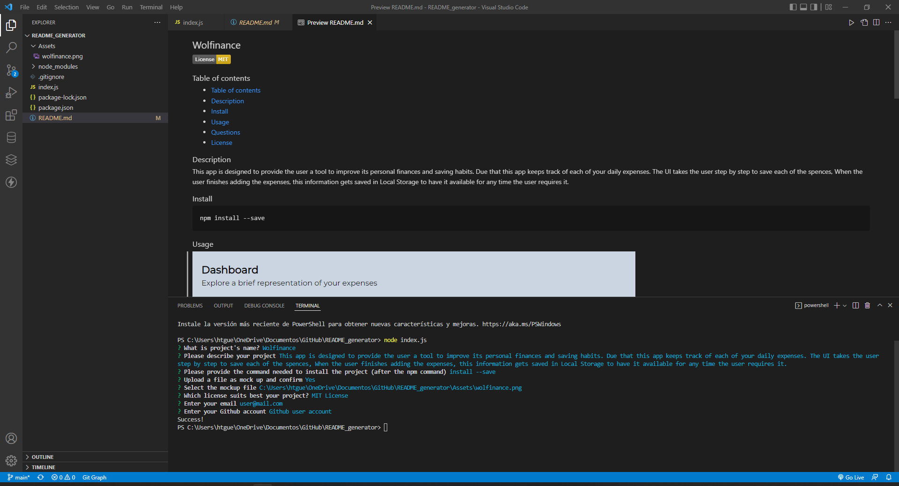

## Wolfinance

### Table of contents

- [Wolfinance](#wolfinance)
  - [Table of contents](#table-of-contents)
  - [Description](#description)
  - [Install](#install)
  - [Usage](#usage)
  - [Questions](#questions)
  - [License](#license)

### Description

This project is intended to provide the user with a simple and fast way to create a high quality README file wich contains information about description, installation, license and contact.

### Install

    npm install inquirer
    npm install inquirer-file-tree-selection-prompt

### Usage

### Questions

For further questions, you can find me at:
- github account: HGuevaraCF.
- email: ht.guevara@hotmail.com.

### License

MIT License

            Copyright (c) [year] [fullname]
            
            Permission is hereby granted, free of charge, to any person obtaining a copy
            of this software and associated documentation files (the "Software"), to deal
            in the Software without restriction, including without limitation the rights
            to use, copy, modify, merge, publish, distribute, sublicense, and/or sell
            copies of the Software, and to permit persons to whom the Software is
            furnished to do so, subject to the following conditions:
            
            The above copyright notice and this permission notice shall be included in all
            copies or substantial portions of the Software.
            
            THE SOFTWARE IS PROVIDED "AS IS", WITHOUT WARRANTY OF ANY KIND, EXPRESS OR
            IMPLIED, INCLUDING BUT NOT LIMITED TO THE WARRANTIES OF MERCHANTABILITY,
            FITNESS FOR A PARTICULAR PURPOSE AND NONINFRINGEMENT. IN NO EVENT SHALL THE
            AUTHORS OR COPYRIGHT HOLDERS BE LIABLE FOR ANY CLAIM, DAMAGES OR OTHER
            LIABILITY, WHETHER IN AN ACTION OF CONTRACT, TORT OR OTHERWISE, ARISING FROM,
            OUT OF OR IN CONNECTION WITH THE SOFTWARE OR THE USE OR OTHER DEALINGS IN THE
            SOFTWARE.
